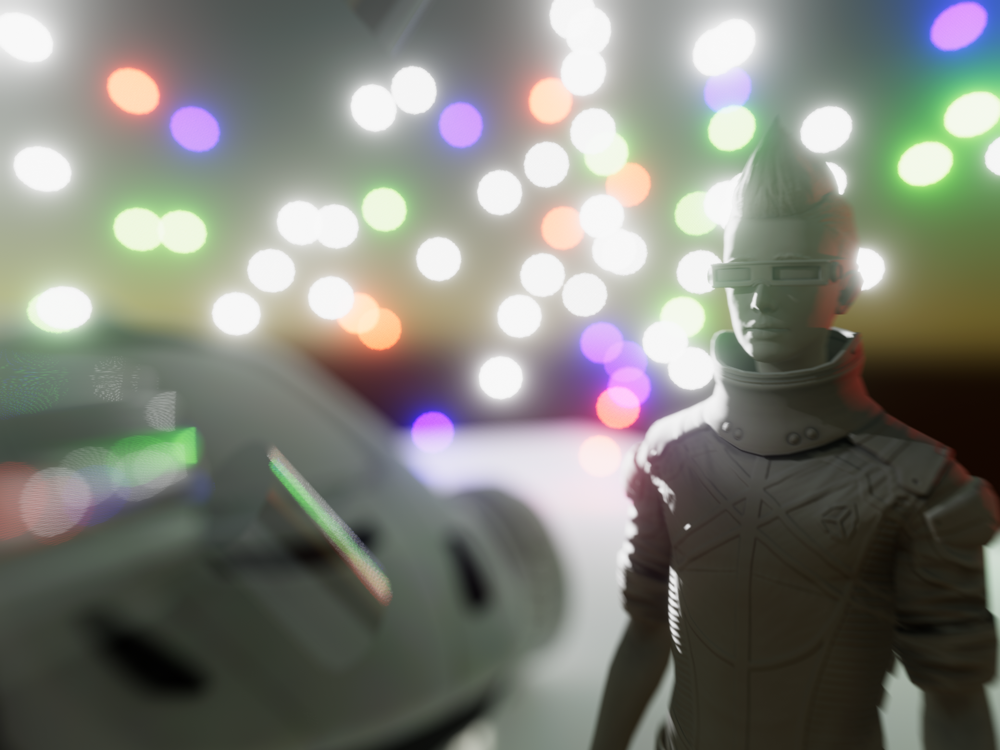
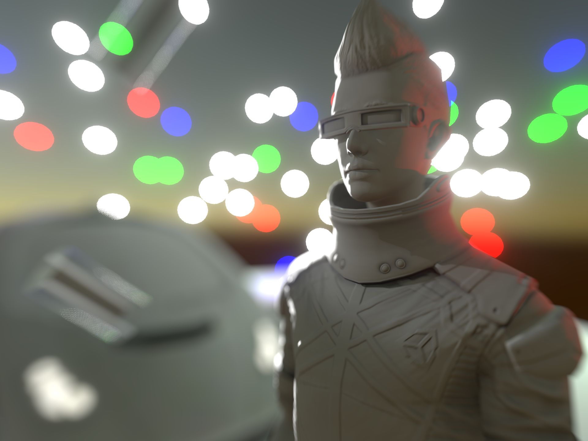
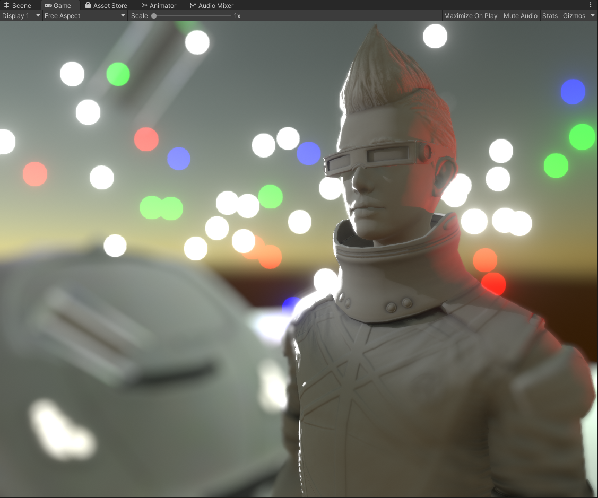
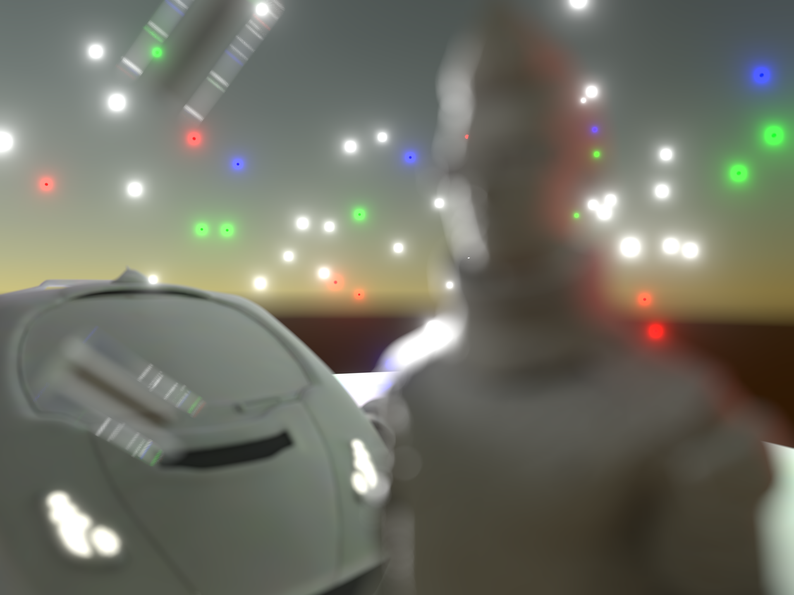
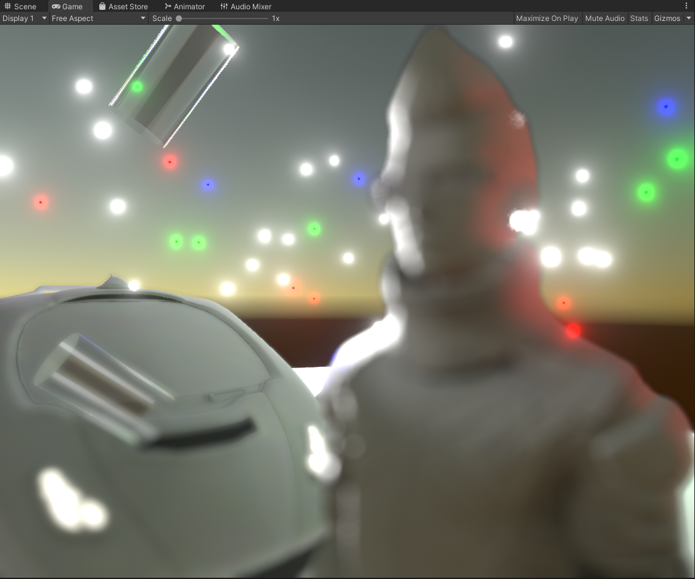
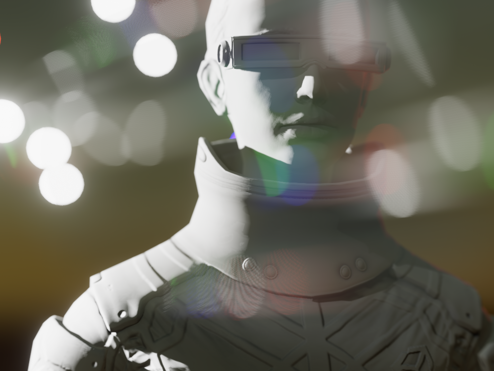
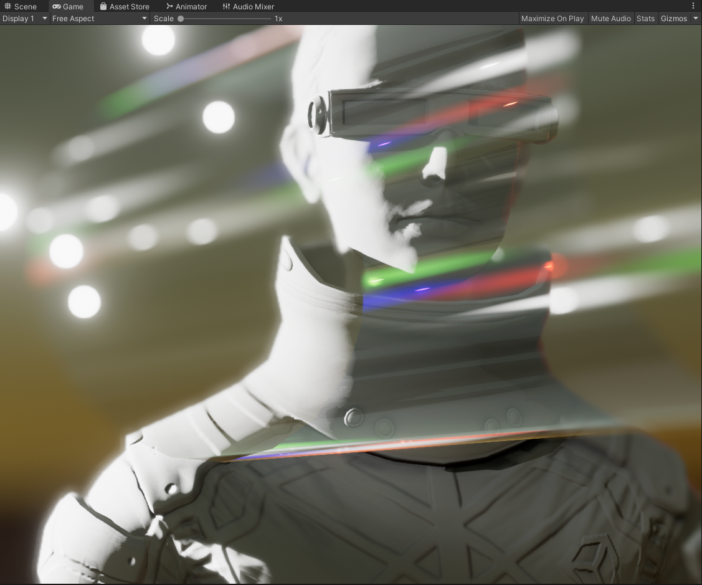
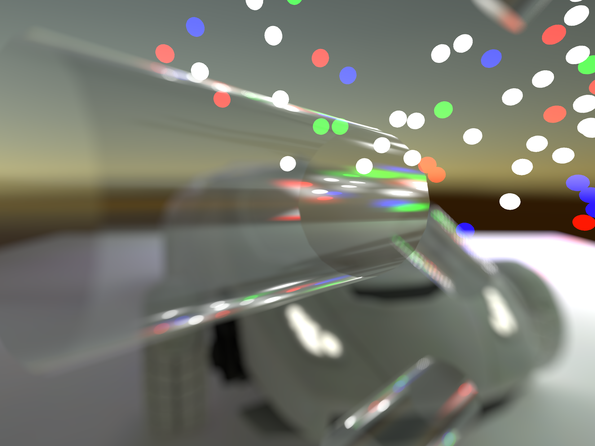
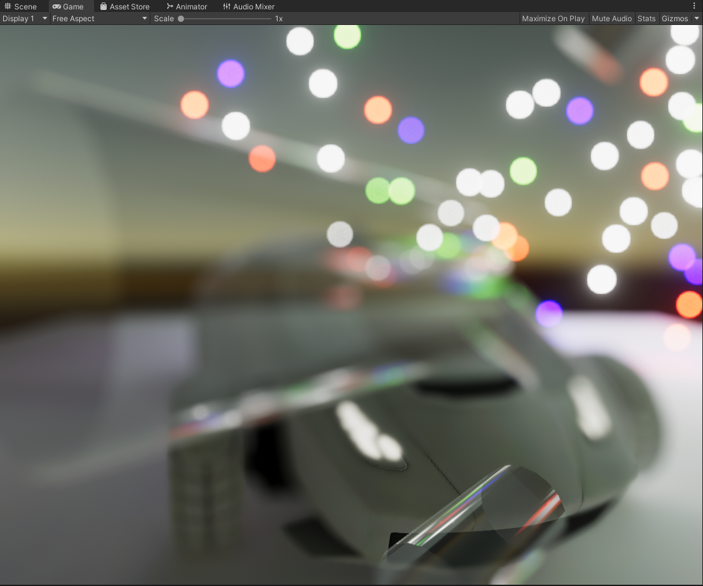

# Unity Offline Depth Of Field

High Quality Offline Depth of Field.

This has none of the short comings of regular Depth of Field effects, and it even works with transparent materials/objects. It works by simply capturing the scene from many different angles in a circle, looking towards the focal point, and accumulating the captures into a render target which then gets saved to the disk.

## Comparisons

#### Offline DOF: Near Focus

#### Runtime DOF: Near Focus

#### Offline DOF: Far Focus

#### Runtime DOF: Far Focus

#### Offline DOF: Transparent Objects In Foreground

#### Runtime DOF: Transparent Objects In Foreground

#### Offline DOF: Focusing on Transparent Object

#### Runtime DOF: Focusing on Transparent Object
